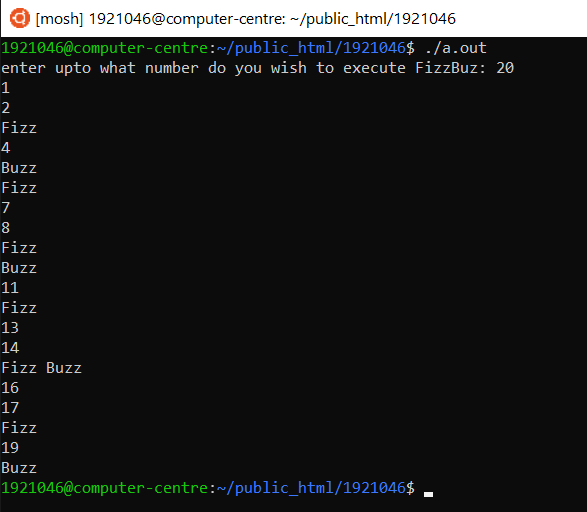
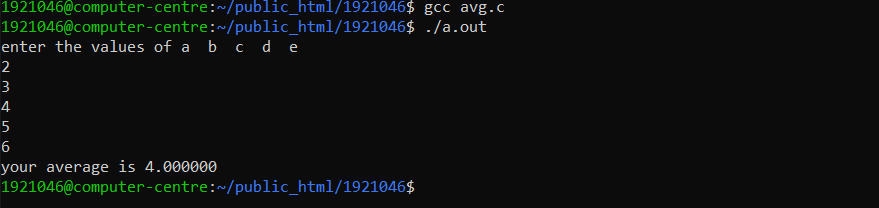
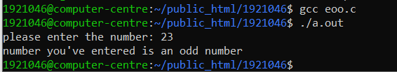
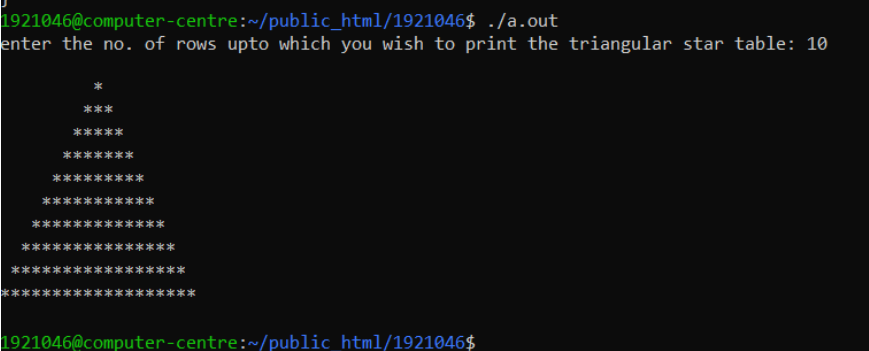
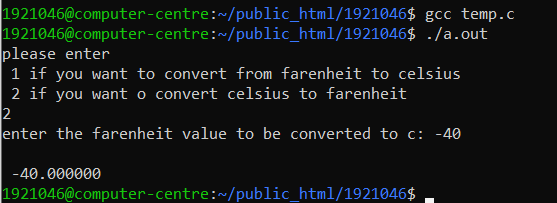
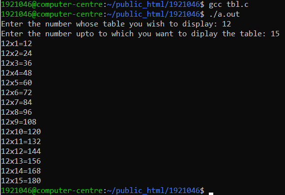
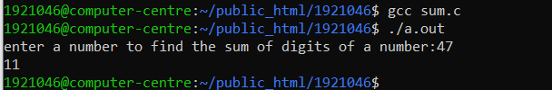
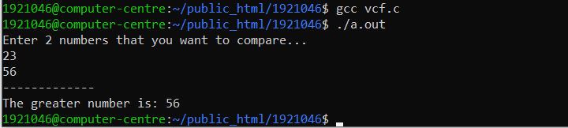


 
 # PROGRAMMING FOR PROBLEM SOLVING ESC -18105
 
 ## My Programs
|                         |                |
| --------------------   | --------------  |
| Submitted by           | JANAV MAKKAR    |
| Roll Number            | 1921046         |
| Branch                 | ITA2            |
| Submitted to           | Er. RANJODH KAUR| 
___________________________________

|   S.No    | Program Name   |
| ----- | --------------  |
| 1 |   FizzBuzz game |
| 2 |   Find Average of 5 Number |
| 3 |   Even or Odd Checker | 
| 4 |   Triangular Star Table |
| 5 |   Celsius-Farenhiet Convertor |
| 6 |   table of an Number upto range |
| 7 |   Sum of Digits of a Number |
| 8 |   Compare two Numbers |
| 9 |   Print College Address      |
| 10|   Factorial of a Number  |
| 11|   Prime Checker |
| 12|   Matrix Multiplication|
| 13|   Calculator|
| 14|   Total Experience of Employees |
| 15|   Sum of Odd or Even Numbers |
| 16|   Even-Odd checker of Number |
| 17|   Find the Greatest Number of All |
| 18|   Addition Of Two Numbers |
| 19|   Program to Find Area, Perimeter and Volume of a Square/Box |
| 20|   Program to Display a Table at Even Positions within a Range of a Given Number |
___________________________________


## 1. FizzBuzz game 

  
````
  #include<stdio.h>

int main()

{int i,n;

printf("enter upto what number do you wish to execute FizzBuz: ");

scanf("%d",&n);

for(i=1;i<=n;i++)

{ if(i%15==0){printf("Fizz Buzz\n");}

else if(i%3==0){printf("Fizz\n");}

else if(i%5==0){printf("Buzz\n");}

else printf("%d\n",i); }

return 0;

}
````

______________________________________________


## 2. Average of 5 Number

   ````
   #include<stdio.h>

float average(float,float,float,float,float);

int main()

{

float a,b,c,d,e ;

average(a,b,c,d,e);

return 0;

}

float average(float a, float b, float c, float d, float e)

{

float g;

printf("enter the values of a b c d e \n");

scanf("%f %f %f %f %f",&a, &b ,&c, &d ,&e );

g = (a+b+c+d+e)/5;

printf("your average is %f \n",g);

}

````

____
## 3. Even or Odd Checker
````
#include<stdio.h>

int main()

{

int a ;

printf("please enter the number: ");

scanf("%d",&a);

if (a%2==0)

{printf("number you've entered is an even number\n");}

else

{printf("number you've entered is an odd number\n");}

}
````

_________

## 4. Triangular Star Table

   ````#include<stdio.h>

int main()

{

int n;

printf("enter the no. of rows upto which you wish to print the triangular star table: ");

scanf("%d",&n);

printf("\n");

int m=2*n-1;

int A[n][m];

int i,j;

for(i=1;i<=n;i++)

{for(j=1;j<=m;j++)

{

if(j>=n-i+1 && j<=n+i-1)

printf("*");

else

printf(" ");

}

printf("\n");

}

printf("\n");

return 0;

}
````

___________
## 5. Celsius-Farenhiet Convertor

  ````#include<stdio.h>

int main()

{

int a ;

puts("please enter \n 1 if you want to convert from farenheit to celsius \n 2 if you want o convert celsius to farenheit");

scanf(" %d",&a);

if(a==1){ float g, h;

printf("enter the celsius temperature value to be converted to f: ");

scanf(" %f",&g);

h=(((g-32)*5)/9);

printf("\n");

printf(" %f f \n",h);

}

else if(a==2){float i,j;

printf("enter the farenheit value to be converted to c: ");

scanf(" %f",&j);

i=(((j*9)/5)+32);

printf("\n");

printf(" %f",i);

}

else printf(" enter only valid characters \n");

return 0;

}
````

__________
## 6. Table of an Number upto range

   ````#include<stdio.h>

int main()

{

int i,a,b;

printf("Enter the number whose table you wish to display: ");

scanf("%d",&a);

printf("Enter the number upto to which you want to diplay the table: ");

scanf("%d",&b);

for(i=1;i<=b;i++)

printf("%dx%d=%d \n",a,i,a*i);

}
````

_________

## 7. Sum of Digits of a Number

   ````#include<stdio.h>

int sum(int c);

int main()

{int a,b ;

printf("enter a number to find the sum of digits of a number:");

scanf("%d",&a);

b=sum(a );

printf("%d\n",b);

}

int sum(int c)

{

int sum=0;int n;

while(c!=0)

{

sum+=c%10;

c=c/10;

}

return sum;}
````

____________

## 8. Compare two numbers

  ````
  #include<stdio.h
void greatNum(); // function declaration

int main(){

greatNum(); // function call return 0;

}

void greatNum(){

int i, j;

printf("Enter 2 numbers that you want to compare... ");

printf("\n");

scanf(" %d", &i);

scanf("%d",&j);

printf("-------------\n");

if(i > j) {

printf("The greater number is: %d\n", i); }

else { printf("The greater number is: %d\n", j); }

}
````

__________

## 9. print College address
````
 
#include<stdio.h>
int main() {

puts("Guru Nanak Dev Engineering College");
puts("Gill Road,");
puts("Ludhiana , Punjab");

return 0;
}
````

_________

## 10. Factorial of a Number 
````
#include<stdio.h>

int fact(int n);

int main() {
    
int n;

printf("Enter an  integer: ");
    scanf("%d", &n);
    printf("Factorial of %d = %d\n", n, fact(n));
    return 0;
}
int fact(int n)
{
    if (n >= 1)
        return n*fact(n-1);
    else
        return 1;
}
````

___________

## 11. Prime Checker
````
#include <stdio.h>
int main()
{
    int n, i, f = 0;                                                                                        printf("Enter a positive integer: ");
    scanf("%d", &n);                                                                                        for(i = 1;i<= n; i++)                                                                                   {
      if(n%i ==0){ f++; }                                                                                     }

     if(f == 2)
       printf("%d is a prime number.\n", n);

     else
       printf("%d is not a prime number.\n", n);


    return 0;
}

````

___________

## 12.  Matrix multiplication
````
#include<stdio.h>
int main(){
int a[10][10],b[10][10],mul[10][10],r,c,i,j,k;
printf("enter the number of row=");
scanf("%d",&r);
printf("enter the number of column=");
scanf("%d",&c);
printf("enter the first matrix element=\n");
for(i=0;i<r;i++)
{
for(j=0;j<c;j++)
{
scanf("%d",&a[i][j]);
}
}
printf("enter the second matrix element=\n");
for(i=0;i<r;i++)
{
for(j=0;j<c;j++)
{
scanf("%d",&b[i][j]);
}
}

printf("multiply of the matrix=\n");
for(i=0;i<r;i++)
{
for(j=0;j<c;j++)
{
mul[i][j]=0;
for(k=0;k<c;k++)
{
mul[i][j]+=a[i][k]*b[k][j];
}
}
}
for(i=0;i<r;i++)
{
for(j=0;j<c;j++)
{
printf("%d\t",mul[i][j]);
}
printf("\n");
}
return 0;
}
````

_____________

## 13. Calculator
````
#include<stdio.h>
int main()
 {
       char operator;
       int a,b;
             printf("Enter an operator(+,-,/,%,*):");
             scanf("%c",&operator);

printf("\nEnter two numbers:\n");
scanf("%d\n %d",&a,&b);
 switch(operator)
                  {
      case'+':  printf("The addition is:%d\n", (a+b) );
       break;
      case'-': printf("The subtraction is:%d\n", (a-b));
       break;
      case'/':printf("The  division is:%d\n", (a/b));
       break;
      case'%': printf("The remainder is:%d\n", (a%b));
       break;
      case'*': printf("The mutiplication is:%d\n", (a*b));
       break;

      default: printf("Enter a valid operator");
       break;
}
}
````

________________________

## 14. Total Experience of Employees
````
#include<stdio.h>
int main()
{
int c;
int a,b;
     printf("Enter no. of employees:");
     scanf("%d",&a);
     printf("Enter their experience:");
  for(int i=1;i<=a;i++){
     scanf("%d",&b);
  c+=b;
}
     printf("Total experience:%d",c);
}
````

____________

## 15. Sum of Odd or Even Numbers
````
#include<stdio.h>

// a program to find the sum of all odd numbers upto a number declared by the user
//son= sum of odd numbers

int main()
{
 int a,b,c,d,e,g,f;

 printf("Enter \n1 if you want to find the the sum of odd numbers \n2 if you want o find the sum even n$
 scanf("%d",&d);

switch(d)
{
 case 1 : printf("upto what number you would like to find the sum of odd numbers: ");
          scanf("%d",&b);

          for(a=1;a<=b;a++){
             if(a%2!=0)
             c = c+a ;        }
          printf("\n");
          printf ("%d\n",c);
     break;

 case 2 : printf("upto what number you would like to find the sum even numbers: ");
          scanf("%d",e);

          for(f=1;f<=e;f++){
             if(f%2==0)
             g=g+f;         }
          printf("\n");
          printf("%d\n",g);
      break;


return 0;

}
}
 
 _________
 ````
   ## 16. Even-Odd checker of Number
   ````
   #include<stdio.h>
int main()
{
int arr[10];
int i;
for(i=0;i<10;i++){
        printf("Enter value of arr[%d]:",i);
        scanf("%d",&arr[i]);
           }

for(i=0;i<10;i++)
        {
       if(arr[i]%2==0){
               printf("\n%d is even.\n",arr[i]);
                     }
}
}
````

___________

## 17 Find the Greatest Number of All


````
#include<stdio.h>
int main()
{
int a;
int arr[10];
   for(a=0;a<10;a++){
      printf("Enter array elements arr[%d]",a);
      scanf("%d",&arr[a]);
}
   for(a=0;a<arr[a];++a){
     if(arr[0]<arr[a])
       arr[0]=arr[a];}
       printf("%d is greater\n",arr[0]);
}
````

____________

## 18. Addition Of Two Numbers
````
#include<stdio.h>
int main()
{
int a,b;
     printf("Enter first no.:");
     scanf("%d",&a);
     printf("Enter second no.:");
     scanf("%d",&b);
int addTwo=a+b;
     printf("Sum:%d+%d=%d",a,b,addTwo);
}
````

__________

## 19. Program to Find Area, Perimeter and Volume of a Square/Box
   ````
    #include<stdio.h>
void square();
int main()
{     
 square();
 return 0;
}                                    
void square()
{
 int side;
   printf("Enter the side of square:");
   scanf("%d",&side);

   printf("\nPerimeter of square:%d",4*side);
   printf("\nArea of square:%d",side*side);
   printf("\nVolume of square:%d\n",side*side*side);
}

````

_______________

## 20. Program to Display a Table at Even Positions within a Range of a Given Number

````
#include<stdio.h>
int main()
{
int a,b,c,d,e;
printf("enter start range:");
scanf("%d",&a);
printf("enter end range:");
scanf("%d",&b);
printf("enter last multiply:");
scanf("%d",&c);
for(d=a;d<=b;d++){
if(d%2==0){
for(e=1;e<=c;e++){
printf("%d*%d=%d\n",d,e,(d*e));
}
printf("\n");
}}
}
````

______________


I am very greatful for all the useful lessons my teachers/professor taught me and  carfully guided me to begin with my journey  to code exceptionally

